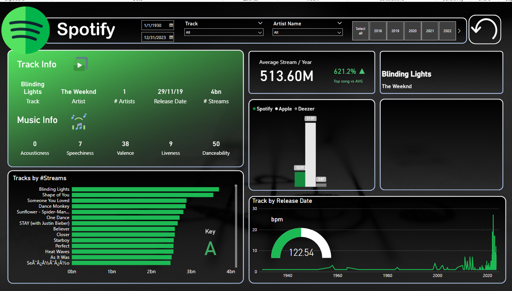

# 🎵 Spotify Data Analysis Dashboard  

Welcome to my Spotify Data Analysis Dashboard project, created using Power BI! This project delves into Spotify’s extensive music streaming data, uncovering trends and insights about song performance, artist popularity, and streaming behaviors.  

---

## 📊 Project Overview  
In this analysis, I transformed raw Spotify data into meaningful visualizations, helping users explore song popularity, music characteristics, and listening trends. This dashboard provides key insights into the platform’s most streamed tracks and artists.  

---

## 🔍 Key Insights  
The dashboard covers a wide range of analytical perspectives, including:  

🎵 Most Streamed Songs: Identify the most played tracks on Spotify.  
🎤 Top Artists: Explore artists with the highest streaming numbers.  
📅 Track Performance Over Time: Analyze how song popularity evolves.  
🎶 Music Characteristics: Dive into attributes like danceability, energy, speechiness, and valence.  
📈 Streaming Trends: Track average streams per year and growth rates.  

---

## 🛠️ Tools & Technologies  
- Power BI – For data visualization and dashboard creation.  
- Data Cleaning & Transformation – Conducted within Power BI using Power Query.  

---

## 📂 Dataset  
The dataset used in this project was sourced from Spotify’s public streaming data, including information on tracks, artists, release dates, and song attributes.  

---

## 🚀 How to Use This Dashboard  
Download the Spotify-Dashboard.pbix file from the repository.  
Open it using Power BI Desktop.  
Interact with slicers and filters to explore different dimensions of the data.  

---

## 📸 Dashboard Preview  

